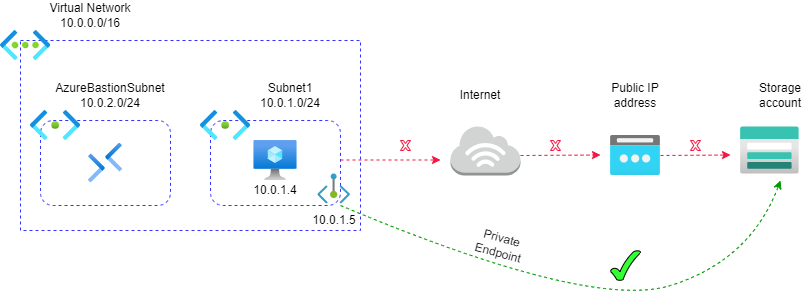
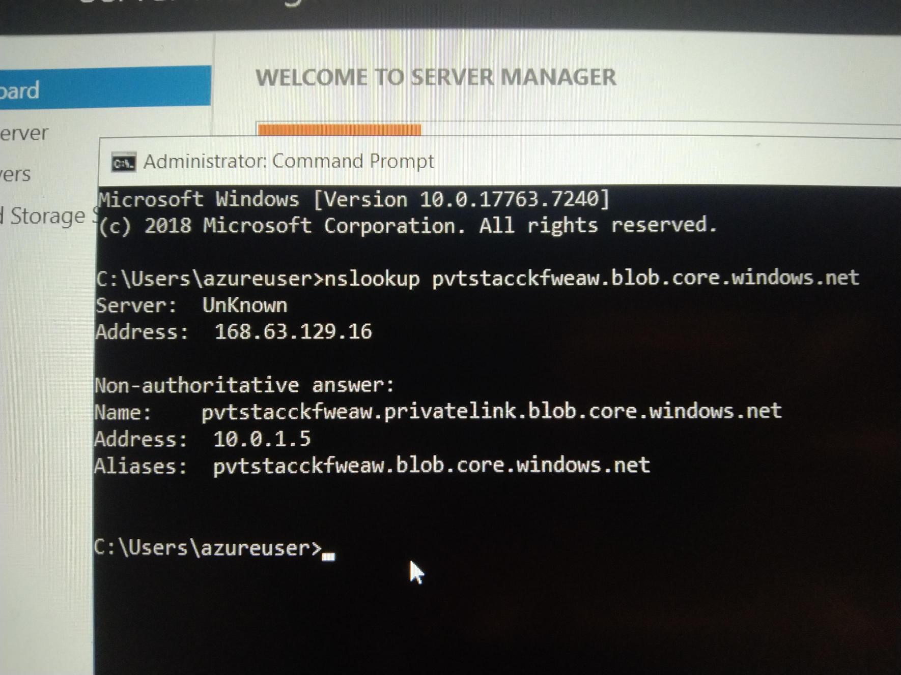
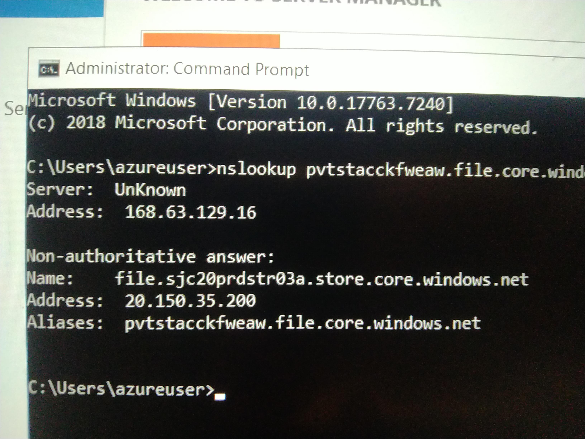

# Azure_Private_Endpoint :

A private endpoint is a network interface that uses a private IP address from your virtual network. This network interface connects you privately and securely to a service that's powered by Azure Private Link. By enabling a private endpoint, you're bringing the service into your virtual network.

A Private Endpoint in Azure is a network interface that securely connects you to Azure services over a private IP address from your Virtual Network (VNet) — essentially, it lets you access Azure services privately, without exposing them to the public internet.

## Architecture Diagram :



###### Apply the Terraform configurations :

Deploy the resources using Terraform,
```
cd pv_demo
```
```
terraform init
```
```
terraform plan
```
```
terraform apply
```

### Further Steps involved are (Azure Portal) :

- First we have to create the Resource Group (pv-rg).
- Next,we create the Virtual Network with subnets (AzureBastionSubnet , Subnet1).
- Deploy the Virtual Machine in Subnet1 and connect with Bastion host.
- Then we create the storage account without public access.
- In storage account Networking section , create the private endpoint for blob storage.
- Link the Virtual Network with Private DNS Zone.

##### Open the Command prompt in Virtual Machine

```
nslookup ${storage_account_name}.blob.core.windows.net
```
Got private Ip (10.0.1.5)



```
nslookup ${storage_account_name}.file.core.windows.net
```
Got public Ip




